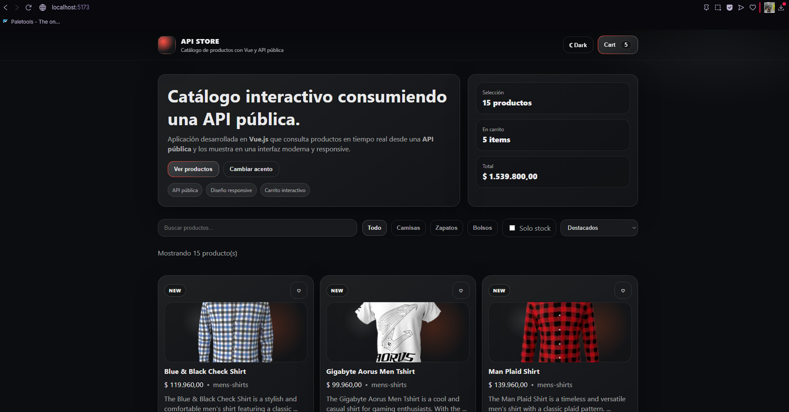
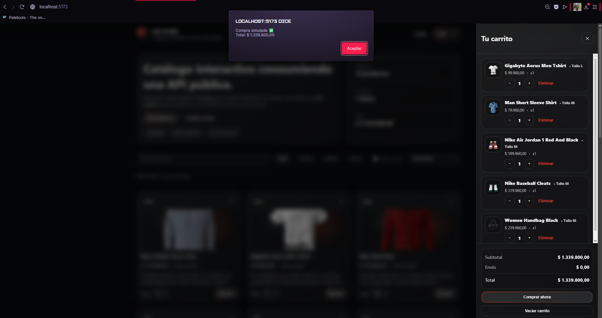
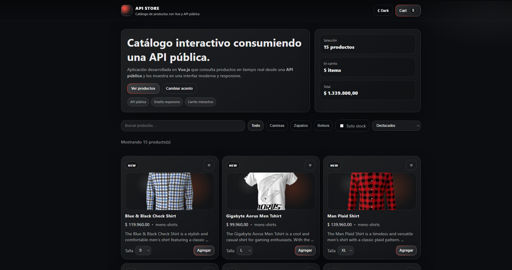
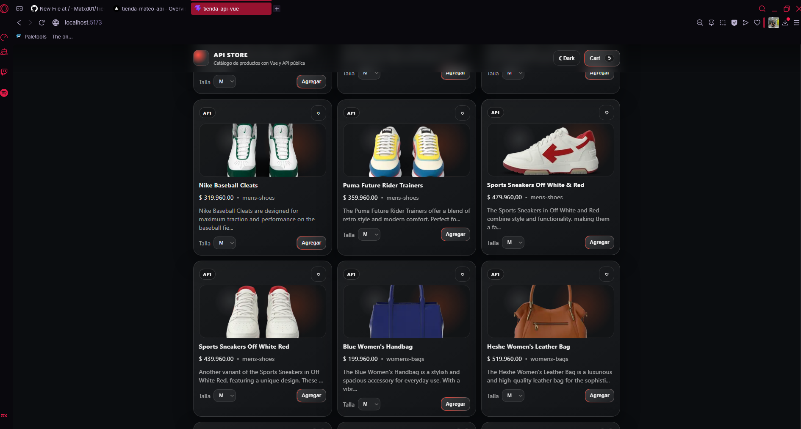

# API Clothing Store

## API Used
This project uses the **DummyJSON API**, a public REST API that provides product data such as titles, descriptions, prices, categories, stock, and images.

Main endpoints used in this application:
- `https://dummyjson.com/products/category/mens-shirts`
- `https://dummyjson.com/products/category/mens-shoes`
- `https://dummyjson.com/products/category/womens-bags`

## Application Description
API Clothing Store is a responsive web application built with **Vue.js** that simulates an online clothing store. The application consumes data from a public API and displays products in a clean, modern, and interactive interface.

Users can browse clothing-related products, filter them by category, search by name or keywords, check stock availability, and add items to a shopping cart. The interface is organized using Vue components and was designed to work correctly on desktop, tablet, and mobile devices.

This project was developed as an academic exercise focused on:
- Vue.js component-based development
- Public API integration using `fetch`
- Responsive web design
- Clear and usable user interface
- Web deployment

## Main Features
- Product data fetched from a public API
- Category filters
- Search bar
- Stock filter
- Product cards with images, prices, categories, and descriptions
- Interactive shopping cart
- Responsive design for different screen sizes

## Technologies Used
- Vue.js
- TypeScript
- HTML5
- CSS3
- JavaScript
- Vite

## Screenshots

### Home Page


### Product Catalog


### Shopping Cart


### Product Counter


### Navigation / Filters


## How to Run the Project
Install dependencies:

```bash
npm install
npm run dev
http://localhost:5173/
